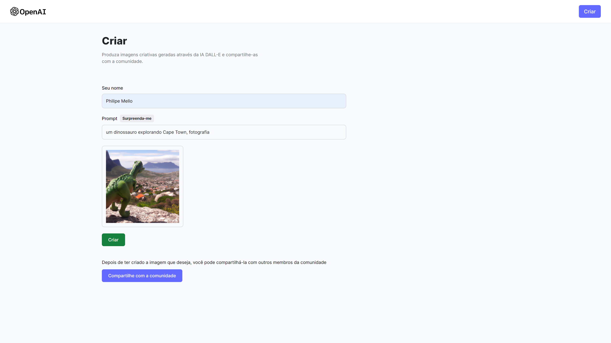
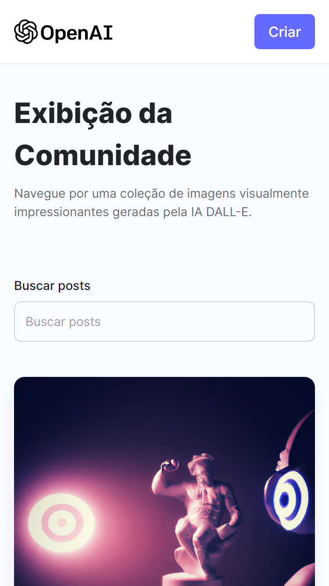
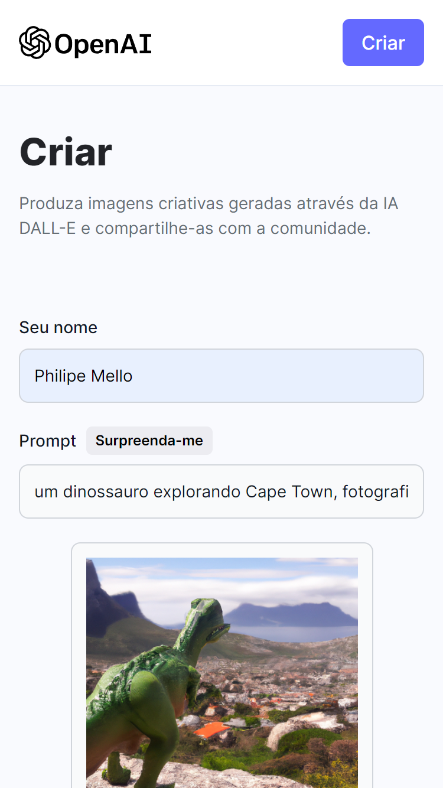

# Gerador de imagens IA

Gerador de imagens com OpenAi DALL-E.
Transforme palavras em arte e dê vida a sua imaginação com o DALL-E.

## Overview

Os usuários devem ser capazes de:

- Criar imagens IA através de palavras.
- Visualizar todas as imagens já criadas pela Comunidade.
- Buscar uma ou mais imagens.
- Fazer download de qualquer imagem.

### Screenshots

#### Desktop

#### Mobile

## Tecnologias

### Feito com

- React 18
- Tailwind CSS
- Node
- Express
- Vite
- MongoDB Atlas
- OpenAi DALL-E API
- Cloudinary

## Autor

- GitHub - [Philipe Mello](https://github.com/Philipessj1)
- Link do App - [Gerador de imagens DALL-E](https://dalle-ai-generator.vercel.app/)
